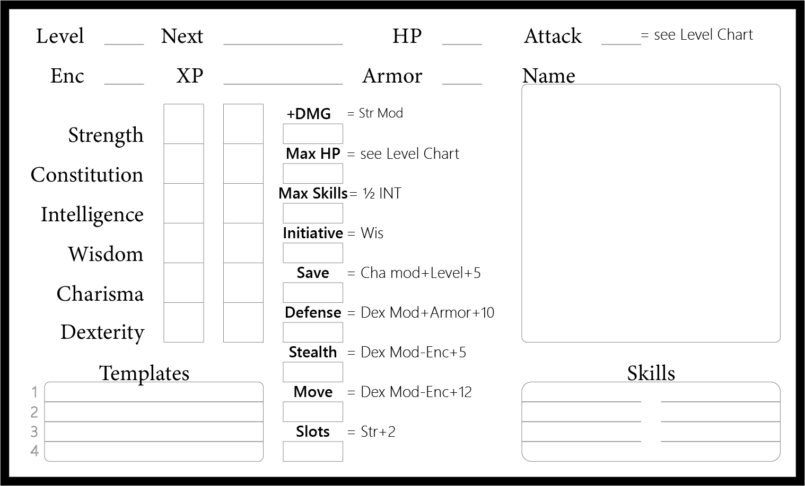

# Player Character Generation Procedure

1. Roll **Attribute** scores. 3D6 six times, in order for variety. 4D4 six times, in order for competence.

2. Note Attribute score **Modifiers**. **ATR MOD** = (ATR Score÷3) – 3, rounding down. You may consult the chart instead of using the formula:

   | Score    | 3-5  | 6-8  | 9-11 | 12-14 | 15-17 | 18   |
   | :------- | :--- | :--- | :--- | :---- | :---- | :--- |
   | Modifier | -2   | -1   | 0    | +1    | +2    | +3   |

3. Choose a **Class**. *Gain the first Class Template and whatever items and tags are attached.*

4. Roll for your background **Profession**. *Gain whatever tags and items are attached.* [Professions](https://coinsandscrolls.blogspot.com/2017/06/osr-1d100-actually-medieval-professions.html?m=1).

5. You may also roll for a race, as explained [here](https://coinsandscrolls.blogspot.com/2017/03/osr-table-of-races.html). Otherwise, you're human. 

6. Note scores derived from the level chart and scores derived from attributes.

   - **Hit Points**. *Hit Points for a level 1 PC begin at Con - 4. After level 1, consult the Level Chart.*
   - **Attack** for a level 1 PC begins at 11. *After level 1, consult the Level Chart.*
   - **Defense** score = 10 + worn armor.
   - **Stealth** = 5 + Dexterity Modifier - Encumbrance.
   - **Movement** = 12 + Dexterity Modifier - Encumbrance.
   - **Initiative** = Wisdom.
   - **Save** = 5 + Charisma Modifier + Level.
   - **Inventory Slots** = Strength. (But gain two more from a backpack)

7. **Name** character.

## Classes

The GM will choose some classes to offer.

This list should probably be short and grow over a campaign to reward exploration of the world, only presenting classes that have been encountered. This might mean beginning a campaign by only offering classes that are skilled in armed combat or it might mean only offering the most basic archetypes (Fighter, Thief, and Spellcaster.) 

There are four templates for each class, labeled A through D. A character begins with template A and gains one template per level for the first four levels. (This means that no character can have more than four templates.) 

Templates can only be gained in order: you cannot gain Fighter B unless you have Fighter A.

To **multiclass**, choose a template from a different class (so a Level 4 PC could have Thief A, Thief B, Fighter A, and Spellcaster A.)

## Starting Items

Some items are gained from the first class template. See the class description. 

The rest of a character's starting items follow:
Backpack (grants two extra slots)
Blanket (1 slot)
Waterskin (1 slot)
Flint and Tinder (0 slots)
6 copper pieces (cp)

## Ability Scores

### Charisma

Personality, persuasiveness.

### Constitution

Health and stamina.

### Dexterity

Agility, reflexes, balance.

### Intelligence

Mental aptitude, rationality, memory.

### Strength

Muscle. 

### Wisdom

Willpower, perception, intuition, instinct.

### Ability Score Modifiers

Ability score modifiers are used to alter other numbers as explained in the character generation section. 

## Hit Points

> Each point *below* 0 HP for a PC = Lethal  = Death and Dismemberment Table

Hit points represent the ability to not be hit. At 0 a character has been physically harmed and must roll on the death and dismemberment table.

A Player Character's maximum Hit Points are derived from Constitution as shown on the Level Chart.

# Inventory and Encumbrance

### Inventory Slots

> **INV** **SLOTS** = STR + 2.
> *First 3 Slots** = instant access.

A player character has inventory slots equal to their strength + 2. This number describes how much they can carry without hindering movement (so long as they are carrying a pack.)

#### Fast access

The first three slots may be instantly accessed without searching the character's pack. If an item is in hand, it's in one of the first three slots. 

To access an item during a combat round, roll the item’s slot number or higher on a d20. If you fail, it was not found. 

### Encumbrance

> **Gain 1 ENC per Slot in excess** of allowed slots.
> **ENC** = penalty to MOVE, STEALTH, and DEX.

Each inventory slot in use beyond the number allotted to a character causes a point of encumbrance. 

Each point of encumbrance causes a penalty of -1 to Movement, Stealth, and Dexterity.

Example: Joe has 14 strength and therefore 16 inventory slots. He is carrying items that require a total of 18 slots, so he has 2 encumbrance points. He normally has 12 dexterity, but he now must act as if he only has 10 dexterity due to the encumbrance penalty. 

> **Small items** (3 scrolls , 3 bottles, 5 torches, 100 coins, 20 arrows) are bundled into 1 Slot.
> *Very small items** (a coin, a garrote) use no slots. 

### Conditions

> **Fatigue, Soaked, and Cold** each use 2 slots. Check CON to avoid gaining fatigue. 

**Fatigue** is gained as a result of exhausting activity. Traveling more than 12 hours adds 1 fatigue per hour.

A player character may check Constitution to resist gaining fatigue. 

**Soaked** is caused by clothing and backpack being wet.

**Cold** is caused by exposure to very cold temperature.

# Experience Points

### Recovered Treasure

> **1 Looted GP = 1XP**, after converted to coins (by sale) and safe.

Coins and any treasure that is converted to coins will produce experience points at a rate of 1 experience point per 1 gold piece, once the treasure is safe. (If a player character sleeps 8 hours or spends the treasure, the treasure is considered "safe.") 

GP stolen from civilized settlements does not count. Only treasure taken from a dungeon, wilderness hideaway, bandits, or other such location counts for experience.

### Division of Experience

> **Split EXP equally**.

Each surviving player character receives an equal percentage of all experience gained from treasure that was obtained through a collaborative effort.

Any NPC who willingly chooses to take combat risks or exploration risks (such as going first into an unexplored room) also receives an equal share of experience.

### Maximum Experience in One Day

A character may not gain any experience past what is necessary to attain the next level until the following day. 

# Levels

Whenever a PC gains a Level, they gain a new Class Template (up to a max of 4.) Their Attack, HP, and Save also increase as shown on the Level Chart.

A PC who has leveled can also attempt to improve whichever stat the other players' believe best suits their character's style by rolling 3D6. If the sum is greater than the Stat, the Stat is permanently raised by +1. A player may attempt the same for a Stat of their choice.

------

### Level Chart

| **Level** | **HP (20 Max)** | **Class Templates** | **Attack** | **Base Save** | **XP (1GP = 1XP)** |
| --------- | --------------- | ------------------- | ---------- | ------------- | ------------------ |
| 1         | Con  - 4        | 1                   | 11         | 6             | -                  |
| 2         | Con  - 2        | 2                   | 12         | 7             | 2,000              |
| 3         | Con             | 3                   | 12         | 7             | 4,000              |
| 4         | Con  + 2        | 4                   | 13         | 7             | 7,000              |
| 5         | Con  +4         | -                   | 13         | 8             | 10,000             |
| 6         | Con  + 6        | -                   | 14         | 8             | 14,000             |
| 7         | Con  +7         | -                   | 14         | 8             | 18,000             |
| 8         | Con  + 8        | -                   | 15         | 9             | 22,000             |
| 9         | Con  + 9        | -                   | 15         | 9             | 26,000             |
| 10        | Con  + 10       | -                   | 15         | 10            | 30,000             |
| +1        | +1              | -                   | 15         | 10            | +5,000             |

### Retirement

At Level 5 a PC can choose to retire from the vagrant lifestyle at any time. They might buy some land to farm, set up a shop, teach at a college, beg for bread, start a ferrying business, or whatever else suits them, within their means.

The player will describe how their character spends their money and what their plans for the future are. Then their fate will be in the hands of the referee and circumstance.

# Healing and Rest

1. A long rest requires 8 hours sleep, warmth, a full meal, and darkness. It restores all HP and removes fatigue. If a requirement is missing, only heal 1D6+Level HP. A character must be awake for at least 12 hours before the next long rest may be taken.

```If a player has Lethal DMG, only heal 1D6+Level Lethal DMG and heal nothing if a requirement is missing.```

1. A Restful Lunch requires 1 hour, water, and a meal. Restores 1D6+Level HP.
2. Remove fatigue by resting 3 hours.
3. DMG to ATR heals at 1 point per week.

# Character Sheet

[PDF](https://drive.google.com/open?id=1mqcc1xaUKrbSl617lyE2uATBW6hO90Qi) with several on one page. [Adobe Illustrator](https://drive.google.com/open?id=1sL1AGbW_TFSmZQwImnwgUKB0_Z6dnh7p) file if you want to edit it.

